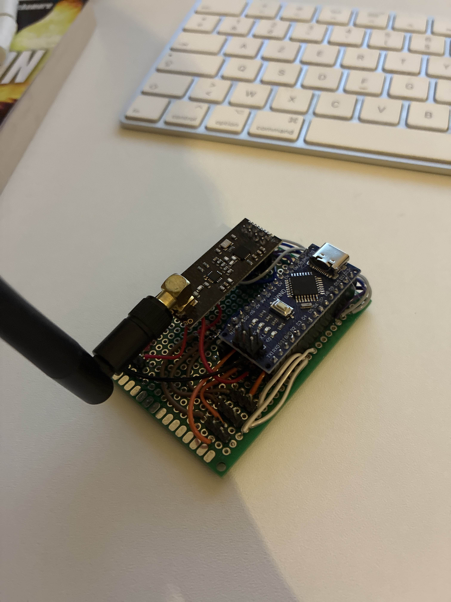
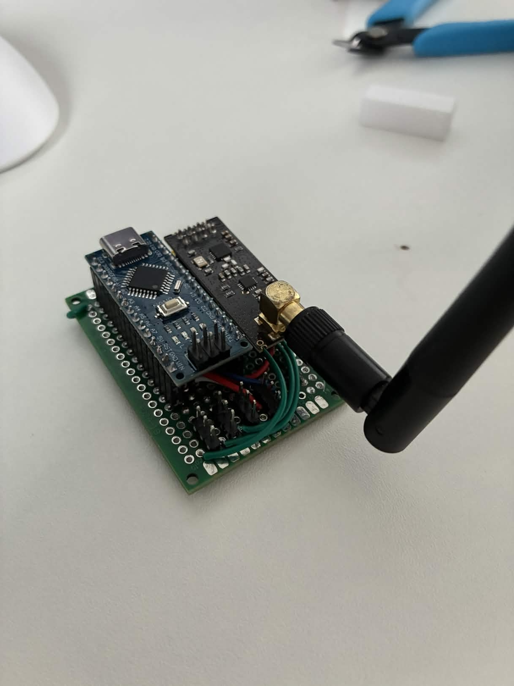
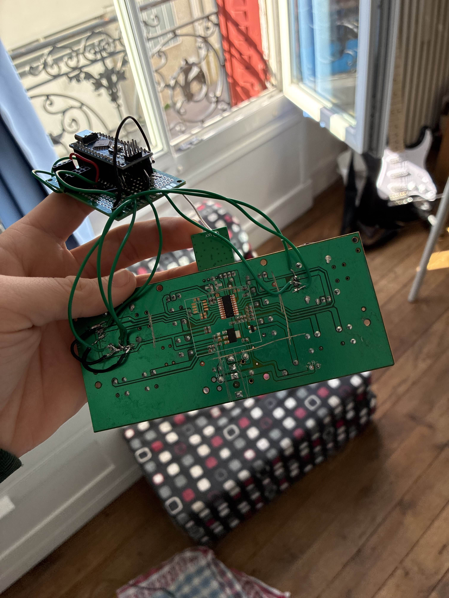
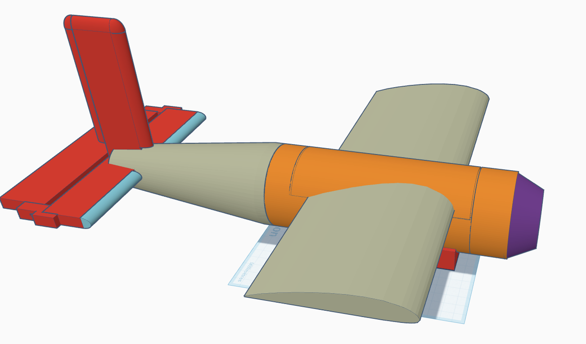
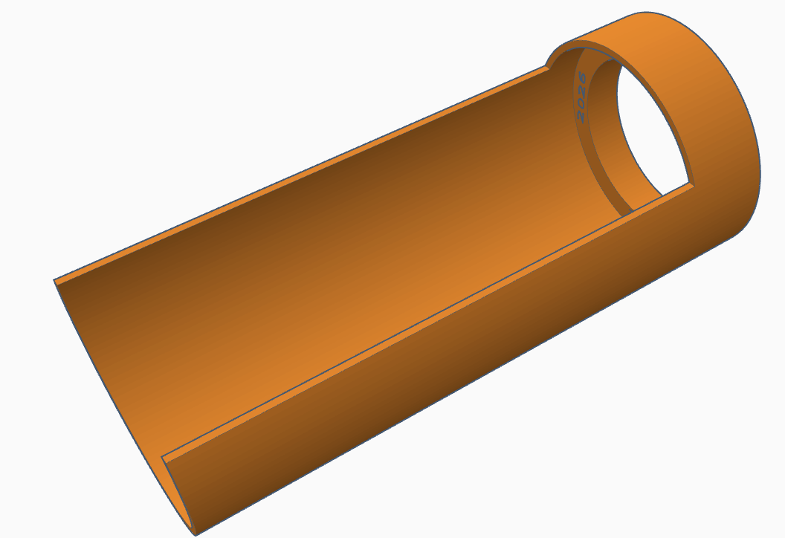
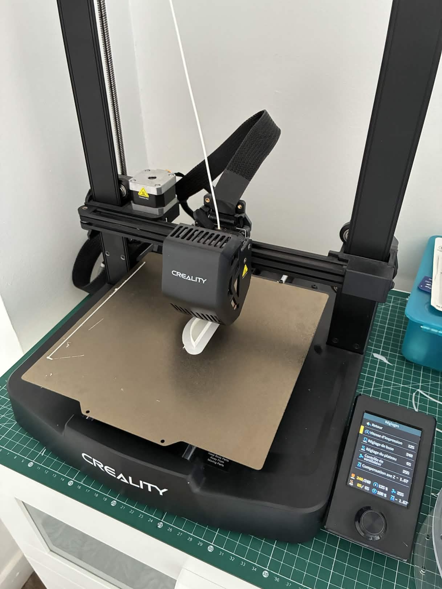
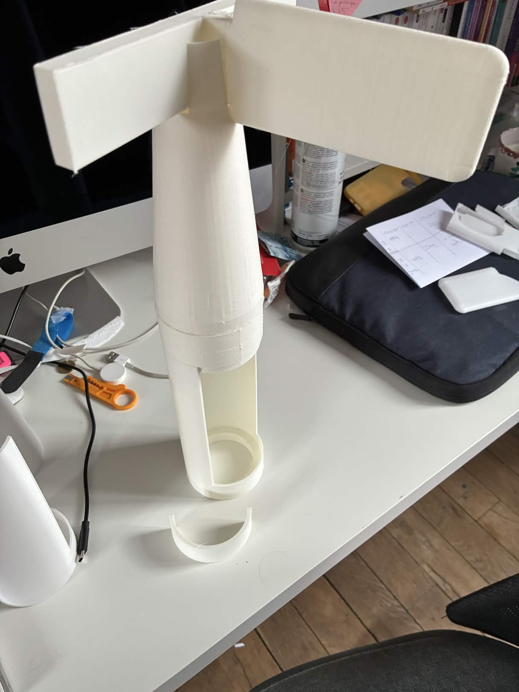

# AvionRC

Construction d'un avion radio-commandé fonctionnel
  - Avec de la programmation en C++ 
  - Avec de la soudure electronique
  - Avec de la modelisation et de l'impression 3D

# Programmation

La carte mere et la télécommande ont été programmés en C++, le langage natif des cartes Arduino

[Code avion](src/avionV5/avionV5.ino)
[Code manette](src/manetteV3/manetteV3.ino)

# Construction de la carte mère

La carte mère est construite sur une plaque de soudure électronique. Le cerveau de la carte mère est une Arduino Nano équipée d'un microprocesseur ATMEGA328, amplement suffisant pour la conception d'un ordinateur de bord. Le module radio est un NRF24L01 avec antenne, dont la portée peut aller jusqu’à 1 km.

Des emplacements sont prevus sur la carte mère afin d'y brancher max 3 Servo-moteurs
Plus tard j'ai realisé une deuxieme version de la carte mère, plus compact, mieux travaillée et donc plus fiable.

# Construction de la manette

La manette a été construite a partir de la télécommande d'un avion qui a été perdu, elle a donc été modifié et amélioré afin de la faire fonctionner avec la carte mère. Elle est équipé des mêmes composants que l'avion: une arduino nano et un NRF24L01.

  
  

# Modelisation et impression 3D

J'ai modelisé l'avion entierement sur tinkercad, avec des formes geometriques simples (cylindre, cubes...) pour que le model soit simple et efficace, mais pas forcement tres ésthetique.

  
  

L'impression 3D a été réalisé avec du filament LW-PLA, qui est un filament pla standart mais qui possède des propriétées expensibles quand on lui applique une forte chaleur (environ 240°C). J'ai rencontré beaucoup de difficultés a reussir a avoir ma première impression avec ce filament car je n'avais pas encore trouvé les bon parametre pour assurer une bonne adhesion de la premiere couche.

  
  

