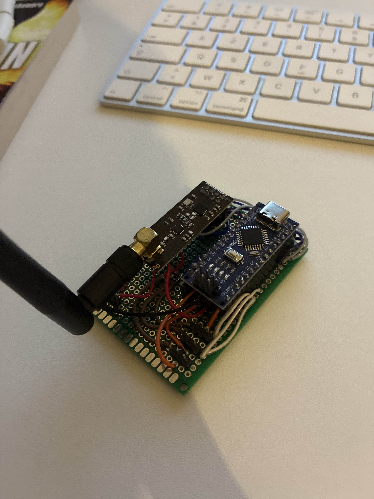
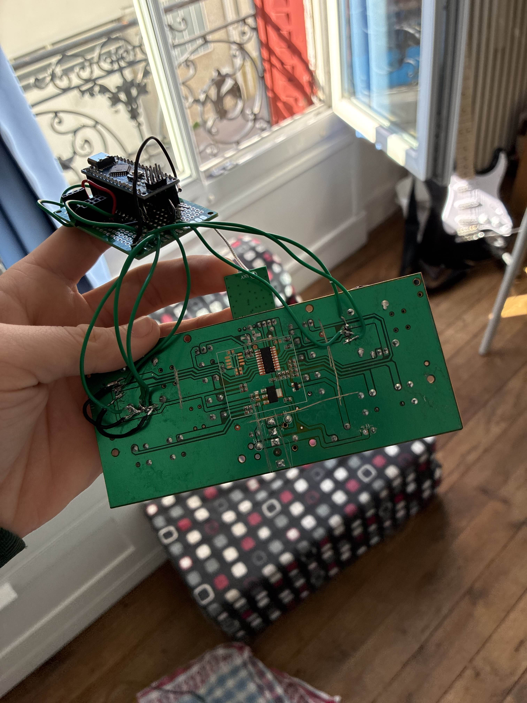

# AvionRC

Construction d'un avion radio-commandé fonctionnel
  - Avec de la programmation en C++ 
  - Avec de la soudure electronique
  - Avec des connaissances en aérodinamisme, et en fonctionnement global d'un avion moderne

# Programmation

La carte mere et la télécommande ont été programmés en C++, le langage natif des cartes Arduino

[Code avion](src/avionV5/avionV5.ino)
[Code manette](src/manetteV3/manetteV3.ino)

# Construction de la carte mère

La carte mère est construite sur une plaque de soudure électronique. Le cerveau de la carte mère est une Arduino Nano équipée d'un microprocesseur ATMEGA328, amplement suffisant pour la conception d'un ordinateur de bord. Le module radio est un NRF24L01 avec antenne, dont la portée peut aller jusqu’à 1 km.

Des emplacements sont prevus sur la carte mère afin d'y brancher max 3 Servo-moteurs

# Construction de la manette

La manette a été construite a partir de la télécommande d'un avion qui a été perdu, elle a donc été modifié et amélioré afin de la faire fonctionner avec la carte mère. Elle est équipé des mêmes composants que l'avion: une arduino nano et un NRF24L01.

  
  

# Impression 3D

Pour l'impression 3D, j'ai utilisé mon imprimante Ender3 V3 SE, il s'agit d'une imprimante entrée de gamme mais qui fait largement le travail demandé pour ce projet, malgrès quelques complications au niveau de l'adhérence au plateau. Pour le filament j'ai utilisé le lw epla de eSun. Pour le model 3D j'ai decidé de ne pas reinventer la roue tout seul, j'ai donc pris le model A de chez elispon, qui est gratuit.

# Résultat final

Apres des années de réflexion et de travail, j'ai pu réaliser mon objectif, faire voler un avion dans les air en le gardant controlable.

